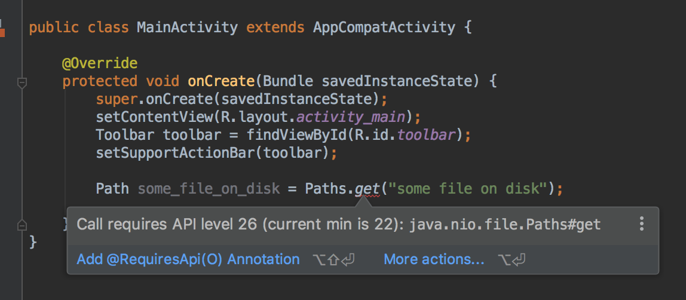
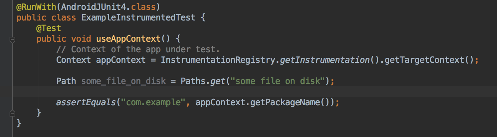

## Android Studio does not warn when using API-specific code in *instrumentation tests*

If I use a method/class that was available in a version *after* my min SDK **in my app code** then Android Studio shows me a warning:

However this is not the case **inside an instrumentation test**. I don't change the minSDK. I duplicate the same code, but no warning!

